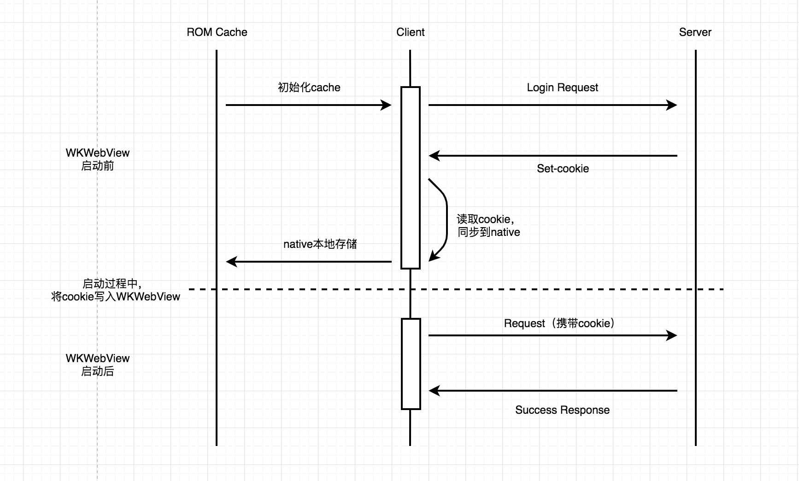

## 你真的了解webview么？

写在前面：

**Webview**是我们前端开发从PC端演进到移动端的一个重要载体，现在大家每天使用的App，webview都发挥着它的重要性。接下来让我们从webview看世界。

#### 一、适用场景
提到应用场景，大家最直观的能想到一些App内嵌的页面，为我们提供各种各样的交互，就像下面图片里的这样：


其实webview的应用场景远远不止这些，其实在一些PC的软件里，和我们交互的也是我们的html页面，只是穿着webview的衣服，衣服太美而我们没有发现他们的真谛。

另外，还有一些网络机顶盒里的交互，也是webview在和我们打交道，比如一些早期的IPTV里的EPG都是运行在webview里的，它们基于webkit内核，尽管我们使用的交互方式是遥控器。

当然，今天我们会从native的角度切入，带大家认识真正的webview。

#### 二、与App native的交互

说了这么多，其实目前使用频率最多的，还是客户端内嵌的webview，小到我们地铁里用手机看的一篇公众号文章，大到我们使用App中的一些重要交互流程，其实都是webview打开m页去承接的。那么，到底m页怎么和native去交互的呢？

目前javascript和客户端（后面统称native）交互的常见方式有两种，一种是通过JSBridge的方式，另一种是通过schema的方式。

###### 1. JSBridge

首先，我们来说说JSBridge。体现的形式其实就是，当我们在native内打开m页，native会在全局的window下，为我们注入一个Bridge。这个Bridge里面，会包含我们与native交互的各种方法、比如判断第三方App是否安装、获取网络信息等等功能。

举个例子：
```
/**
 * 作用域下的JSBridge，
 * 和实例化后的getNetInfomation，
 * 均根据实际约定情况而定，
 * 这里只是用来举例说明
 */
const bridge = window.JSBridge;
console.log(bridge.getNetInfomation());
```

- IOS端

    在IOS中，主要使用WebViewJavascriptBridge来注册，可以参考[Github WebViewJavascriptBridge](https://github.com/marcuswestin/WebViewJavascriptBridge)

```
    jsBridge = [WebViewJavascriptBridge bridgeForWebView:webView];

    ...

    [jsBridge registerHandler:@"scanClick" handler:^(id data, WVJBResponseCallback responseCallback) {
        // to do
    }];
```

- Android

    在Android中，需要通过addJavascriptInterface来注册

```
class JSBridge{
    @JavascriptInterface //注意这里的注解。出于安全的考虑，4.2 之后强制要求，不然无法从 Javascript 中发起调用
    public void getNetInfomation(){
        // to do
    };
}

webView.addJavascriptInterface(new JSBridge();, "JSBridge");
```

###### 2. Schema url

如果说Bridge的方式是只能在native内部交互，那么**schame url**的不紧可以在native内交互，也是可以跨app来交互的。**schema**也是目前我们转转使用的主要方式，它类似一个伪协议的链接（也可以叫做统跳协议），比如：

> schema://path?param=abc

在webview里，当m页发起schema请求时，native端会去进行捕获。这里可以顺带给大家普及一下IOS和Android的知识，具体如下：

- IOS端

    以UIWebView为例，在IOS中，UIWebView内发起网络请求时，可以通过delegate在native层来拦截，然后将捕获的schema进行触发对应的功能或业务逻辑（利用shouldStartLoadWithRequest）。代码如下：
```
- (BOOL)webView:(UIWebView *)webView shouldStartLoadWithRequest:(NSURLRequest *)request navigationType:(UIWebViewNavigationType)navigationType {
    //获取scheme url后自行进行处理
    NSURL *url = [request URL];
    NSString *requestString = [[request URL] absoluteString];
　　return YES;
}
```
- Android端

    在Android中，可以使用shouldoverrideurlloading来捕获schema url。代码如下：
```
public boolean shouldOverrideUrlLoading(WebView view, String url){
    //读取到url后自行进行分析处理

    //这里注意：如果返回false，则WebView处理链接url，如果返回true，代表WebView根据程序来执行url
    return true;
}
```

上面分别是IOS和Android简单的schema捕获代码，可以在函数中根据自己的需求，执行对应的业务逻辑，来达到想要的功能。

---

当然，刚才我们提到通过schema的方式可以进行跨端交互，那具体如何操作呢？

其实对于JavaScript，在webview里基本是一样的，也是发起一个schema的请求，只不过在native测会有些许变化。

首先，给大家普及一个小知识，就是在natvie中（包括IOS和Android），每个App都是会注册一个专属于自己的schema，就像是ios的appId一样，不可以重复。

那么，有了这个知识点做铺垫，就可以理解，当我们在其他app中，像这个schema发起请求时，系统底层（IOS & Android）会通过schema去找到所匹配的app，然后将此App拉起。拉起app后，对应处理如下：

- IOS端

    在IOS端内，会将schema作为参数传入一个提前定义好的回调函数内，然后执行该回调函数。此回调函数，可以通过得到的schema去进行解析，然后定向到app内的固定的某个页面。

```
- (BOOL)application:(UIApplication *)application openURL:(NSURL *)url sourceApplication:(NSString *)sourceApplication annotation:(id)annotation{
    // 参数 url 即为获取的 schema
    // to do
}
```

- Android端

    在Android端内，会通过schema或者对应的Android包名，找到唯一的app。然后进入到此app的一个入口载体页面中，执行主类的方法。通过此方法，同样会接收到一个schema的参数，再去解析这个schema，最终定向到固定的App内的某个页面，从而完成交互。

```
    // todo
```

这也是我们在第三方app内，可以调起自己app的原理。当然现在市场上一些app，为了怕有流量流失，会对schema进行限制，只有plist白名单里的schema才能对应拉起，否则会被直接过滤掉。比如我们的wx爸爸，开通白名单后，才可以使用更多的jsApiList，通过schema的拉起就是其中之一，在此不做赘述…… :）

#### 三、webview的进化

对于webview，要说进化、或者蜕变，让我第一想到的就是IOS的**WKWebView**了，每一个事物存在都有它的必然，让我们一起看看这个super版的webview。

###### 1. WKWebView的出现

目前混合开发已然成为了主流，为了提高体验，WKWebView在IOS8发布时，也随之一起诞生。在这之前IOS端一直使用的是UIWebView。

从性能方面来说，WKWebView会比UIWebView高很多，可以算是一次飞跃。它采用了跨进程的方案，用 Nitro JS 解析器，高达 60fps 的刷新率。同时，提供了很好的H5页面支持，类比UIWebView还多提供了一个加载进度的属性。目前一些一线互联网app在IOS已经切换到了WKWebView，所以感觉我们无法拒绝。

整个WKWebView的初始化也很简单：

```
WKWebView *webView = [[WKWebView alloc] init];
NSURL *url = [NSURL URLWithString:@"https://m.zhuanzhuan.com"];
[webView loadRequest:[NSURLRequest requestWithURL:url]];
```

基本和UIWebView的很像。

###### 2. WKWebView 与 UIWebView的对比

上面有提到性能的提升，为什么 app 接入 WKWebView 之后，相对比 UIWebView 内存占用小那么多，主要是因为网页的载入和渲染这些耗内存和性能的过程都是由 WKWebView 进程去实现的（WKWebView是独立于app的进程）。如下图：


这样，互相进程独立相当于把整个App的进程对内存的占用量减少，App进程会更为稳定。况且，即使页面进程崩溃，体现出来的就是页面白屏或载入失败，不会影响到整个App进程的崩溃。

除了上面说的性能以外，WKWebView会比UIWebView多了一个询问过程。在服务器完成响应之后，会询问获取内容是否载入到容器内，在控制上会比UIWebView更细粒度一点，也可以在一些通信上更好的和m页进行交互。大概流程如下图：


WKWebView 的代理协议为 WKNavigationDelegate，对比 UIWebDelegate 首先跳转询问，就是载入 URL之前的一次调用，询问开发者是否下载并载入当前 URL，UIWebView 只有一次询问，就是请求之前的询问，而 WKWebView 在 URL 下载完毕之后还会发一次询问，让开发者根据服务器返回的 Web 内容再次做一次确定。


#### 四、任重而道远

前面说到WKWebView这么赞，其实开发中也有一些痛点。不同于UIWebView，WKWebView很多交互都是异步的，所以在很大程度上，在和m页通信的时候，提高了开发成本。

###### 1. cookie

首先就是cookie问题，这个目前我认为也是WKWebView在业界的一个坑。之前出现过一个问题，就是在IOS登陆完成后，马上进入m页，会有登录态的cookie获取不到的问题。这个问题在UIWebView中是不存在的。

经过调研发现，主要问题是UIWebView对cookie是通过**NSHTTPCookieStorage**来统一处理的，服务端响应时写入，然后在下次请求时，在请求头里会带上相应的cookie，来做到m页和native共享cookie的值。

但是在WKWebView中，则不然。它虽然也会对**NSHTTPCookieStorage**来写入cookie，但却不是实时存储的。而且从实际的测试中发现，不同的IOS版本，延迟的时间还不一样，无意对m页的开发者是一种挑战。同样，发起请求时，也不是实时读取，无法做到和native同步，导致页面逻辑出错。

针对这个问题，目前我们转转的解决方法是需要客户端手动干预一下cookie的存储。将服务响应的cookie，持久化到本地，在下次webview启动时，读取本地的cookie值，手动再去通过native往webview写入。大致流程如下图：



当然这也不是很完美的解决方案，因为偶尔还有spa的页面路由切换的时候丢失cookie的问题。cookie的问题还需要我们和客户端的同学继续去探索解决。在这里，如果大家有什么好的建议和处理方法欢迎留言，大家一起学习进步。

###### 2. 缓存

除了cookie以外，WKWebView的缓存问题，最近我们也在关注。由于WKWebView内部默认使用一套缓存机制，开发者可以操作的权限会有限制，特别是IOS8版本，也许是当时刚诞生WKWebView的缘故，还很不完善，根本没法操作（当然相信IOS8很快会退出历史舞台）。对于一些m页的静态资源，偶尔会出现缓存不更新的情况，着实让人头疼。

但在IOS 9 之后，系统提供了缓存管理的接口 **WKWebsiteDataStore**。

```
// RemoveCache
NSSet *websiteTypes = [NSSet setWithArray:@[
                                            WKWebsiteDataTypeDiskCache,
                                            WKWebsiteDataTypeMemoryCache]];
NSDate *date = [NSDate dateWithTimeIntervalSince1970:0];
[[WKWebsiteDataStore defaultDataStore] removeDataOfTypes:websiteTypes
                                           modifiedSince:date
                                       completionHandler:^{
}];
```

至于IOS8，就只能通过删除文件来解决了，一般WKWebView的缓存数据会存储在这个目录里：
> ~/Library/Caches/BundleID/WebKit/

可通过删除该目录来实现清理缓存。

---

另外，以上我们说的痛点以外，还有webview的通病，就是我们每次首次打开m页时，都要有webview初始化的过程，那么如何减少初始化webview的时间，也是我们可以提高页面打开速度的一个重要环节。

当然，为了提高页面的打开速度，咱们m页也可以跟native去结合，做一些离线方案，目前转转内部也有一些离线页面的项目有上线，今天就不在此展开。


讲到这里，我们也进入尾声了，也许不久的将来各种新兴的技术会掩盖一些webview的光环，像react-native、小程序、安卓的轻应用开发等等，但是不可否认的是，webview不会轻易退出历史舞台，我们会把交互做的更好，我们也有情怀。哪有什么岁月静好，只不过有人负重前行……
