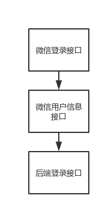
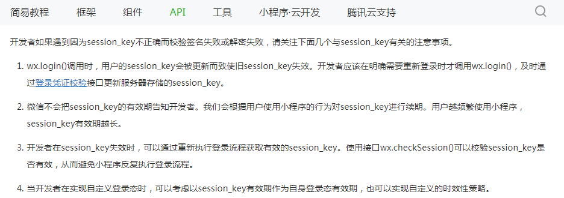
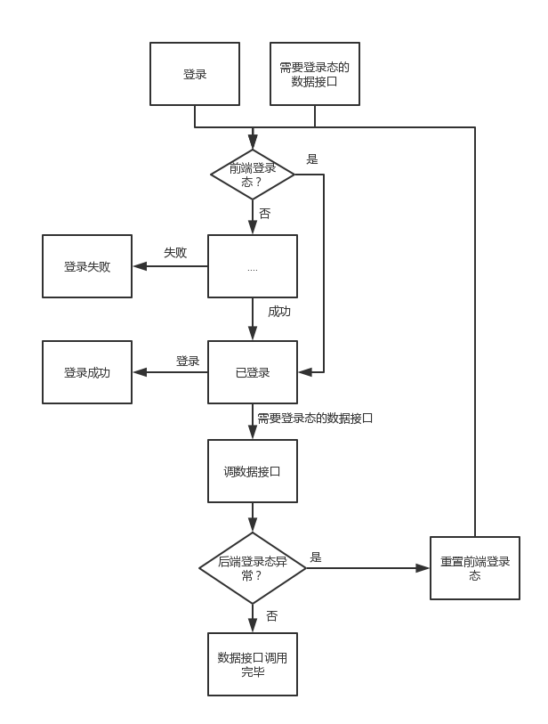
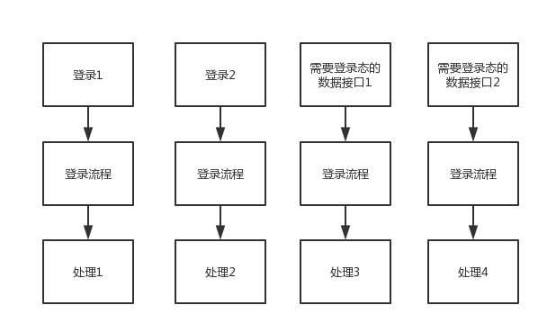
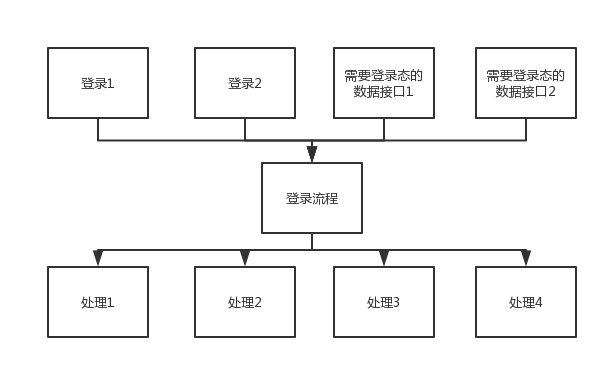
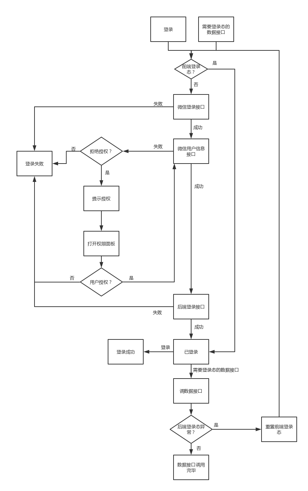
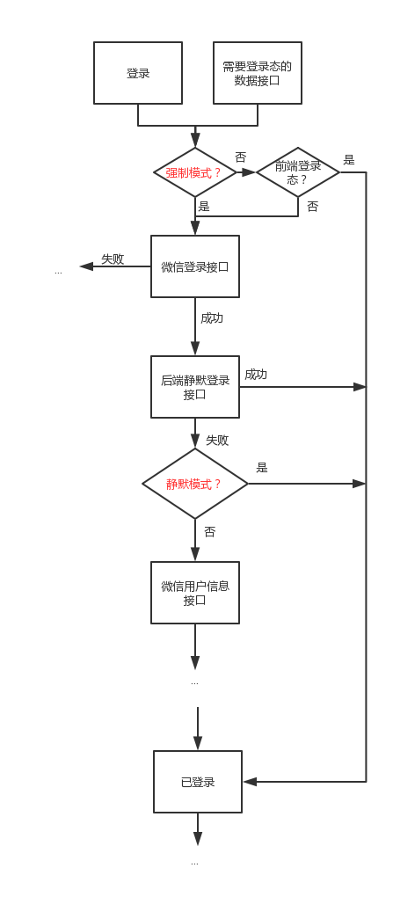

# 健壮高效的小程序登录方案
<!--
标题：健壮高效的小程序登录方案
副标：拒绝授权、过期、免并发、定制弹窗、静默登录、场景适配、多端复用、……
封面：images/健壮高效的小程序登录方案/cover.png
作者：吴鹏和
-->

登录是一项核心基础功能，通过登录对用户进行唯一标识，继而才可以提供各种跟踪服务，如收藏、下单、留言、消息、发布、个性化推荐等。小程序功能的方方面面大多会直接/间接涉及登录，因而，登录功能健壮与否高效与否是值得重点关注与保障的。

登录涉及的面比较多：触发场景上，各种页面各种交互路径都可能触发登录；交互过程上，既需要用户提供/证明id，也需要后端记录维护，还需要保证安全性；复用场景上，既是通用功能，需要多场景多页面甚至多小程序复用，又是定制功能，需要各场景/页面/小程序区分处理。要做到各种情形下都有良好的交互体验，且健壮、高效、可复用、可扩展、可维护，还是相对比较复杂的。
 
本文将探讨小程序登录过程中的一些主要需求和问题，以渐进迭代的方式提出并实现一个健壮、高效、可复用、可扩展、可维护的登录方案。

顺带一提，es6语法中的async/await、Promise、decorator等特性对于复杂时序处理相当有增益，在本文中也会有所体现。

## 基础流程
  
如上图所示，基础登录流程为：  
- 调用微信登录接口wx.login获取微信登录态
- 调用微信用户信息接口wx.getUserInfo获取微信用户信息  
  （update：后来微信调整了授权机制，不能通过wx.getUserInfo接口直接调起授权弹窗了，处理方式参见本文[界面优化](#界面优化)小节）
- 调用后端登录接口，根据微信用户标识及信息，记录维护自己的用户体系
 
该流程主要基于以下考虑：  
- 交互上，用户只需在微信的授权弹窗上点击确认，不需要输入账号密码等复杂操作；
- 体验上，可以直接获取微信昵称头像等作为初始用户信息，使用起来更亲切，传播时好友辨识度也更高；
- 开发上，可以直接使用或映射微信用户标识，无需自己进行标识的生成和验证；
- 安全上，微信已经在用户信息的获取、传输、解密等环节做了许多处理，安全性相对有保障。
 

## 健壮流程
### 拒绝授权问题

**update：**
微信将授权机制由接口授权改为使用&lt;button&gt;组件授权后，此问题不复存在，本小节相关内容不再需要。

**问题：**  

获取微信用户信息时，会出现一个授权弹窗，需要用户点击“允许”才能正常获取；  
若用户点击“拒绝”，不仅当次登录会失败，一定时间内后续登录也会失败，因为短期内再次调用微信用户信息接口时，微信不会再向用户展示授权弹窗，而是直接按失败返回。  
这样导致用户只要拒绝过一次，即使后来对小程序感兴趣了愿意授权了，也难以再次操作。

**方案：**  
    
如上图所示，增加以下流程以处理拒绝授权问题：
- 获取微信用户信息失败时，判断是否近期内拒绝授权导致；
- 若为拒绝授权导致，则提示并打开权限面板，供用户再次操作；
- 若用户依然未授权，则本次登录失败，否则继续后续流程。  

这样，用户拒绝授权只会影响本次登录，不至于无法进行下次尝试。

### 登录态过期问题
**问题：**  
- 微信登录态有效期不可控  
  
上图截自微信官方文档，从中可以看出：
    + 后端session_key随时可能失效，什么时候失效开发者不可控；
    + 要保证调用接口时后端session_key不失效，只能在每次调用前先使用wx.checkSession检查有效期或直接重新执行微信登录接口；  
    + 前端不能随便重新执行微信登录接口，可能导致正在进行的其它后端任务session_key失效；
    
    此外，实践中发现，wx.checkSession平均耗时约需200ms，每次接口调用前都先检查一遍，开销还是蛮大的。  

    如何既保证接口功能正确有效，又不用每次耗费高额的查询开销，成为了一个问题。  

- 后端登录态过期  
后端自身的登录态有效期也存在类似的问题，有可能在调用接口时才发现后端登录态已过期。

**方案：**  
  
如上图所示，增加以下流程以处理登录态过期问题：
- 调用数据接口时显式指明是否需要登录态，若需要则在接口调用前后自动加入登录态校验逻辑；
- 接口调用前只校验前端登录态，不校验后端登录态，也不校验微信登录态，以节省每次校验开销；
- 接口调用后校验后端及微信登录态，若后端返回登录态相关错误码，则重置前端登录态、重新登录、重新调用数据接口。  

这样，只有在真正需要重新登录的时候（无前端登录态/后端登录态失效/后端被提示微信登录态失效）才会重新执行登录流程；并且，一旦需要重新登录，就会自动重新触发登录流程。  

### 并发问题
**问题：**  
  
如上图所示，页面各组件各功能有可能同时触发登录流程，可能会导致：  
- 额外性能开销，登录流程重复进行，登录接口重复调用；
- 体验问题，连续多次弹窗，影响用户交互；
- 逻辑问题，后一次登录刷新了前一次登录的session_key，导致前一次登录接口解码失败，返回异常结果。

**方案：**  
  
如上图所示，加入免并发逻辑：若登录流程正在进行，则不重复触发登录流程，而是加入当前流程的监听队列，待登录结束时再一并处理。这样，任一时刻最多只有一个登录流程正在进行。

## 流程实现
### 时序控制  
  
如上图所示，目前登录流程已较为复杂，步骤较多，且大多是异步操作，每步成功失败需要区分处理，处理过程又会相互交织。如果直接在微信接口/网络接口提供的success/fail回调中进行逻辑处理，会造成：  
- 回调层层嵌套，影响代码书写和阅读；
- 不同路径公共步骤难以统一提取；
- 时序逻辑不直观，不易管理。  

因而采用Promise+async/await进行时序管理：  

- 将每个步骤Promise化：  

```js
class Login {
  static _loginSteps = { //各登录步骤
    /**
     * 微信登录：调用微信相关API，获取用户标识（openid，某些情况下也能获得unionid）
     * @return {Promise<Object>} 微信用户标识
     */
    wxLogin(){
      return new Promise((resolve,reject)=>{ //结果以Promise形式返回
        wx.login({
          success(res){
            resolve(Object.assign(res, {succeeded: true})); //成功失败都resolve，并通过succeeded字段区分
          },
          fail(res){
            resolve(Object.assign(res, {succeeded: false})); //成功失败都resolve，并通过succeeded字段区分
          },
        })
      });
    },
    /**
     * 获取微信用户信息：调用微信相关API，请求用户授权访问个人信息
     * @return {Promise<Object>} 微信用户信息
     */
    requestUserInfo(){
      return new Promise((resolve,reject)=>{ //结果以Promise形式返回
        //... 
      });
    },
    //...
  }
}
```

- 使用async/await管理整体时序：  

```js
  class Login {
    static async _login(){ //管理整体时序
      //....

      let steps = Login._loginSteps;

      //微信登录
      let wxLoginRes = await steps.wxLogin();
      if (!wxLoginRes.succeeded) //微信登录接口异常，登录失败
       return { code: -1};
      
      //获取微信用户信息
      let userInfoRes = await steps.requestUserInfo();
      
      if (!userInfoRes.succeeded && userInfoRes.failType==='userDeny'){ //用户近期内曾经拒绝授权导致获取信息失败
       await steps.tipAuth(); //提示授权
       let settingRes = await steps.openSetting(); //打开权限面板
       if (!settingRes.succeeded) //用户依然拒绝授权，登录失败
         return {code: -2};
         
       userInfoRes = await steps.requestUserInfo(); //用户同意授权，重新获取用户信息
      }
      
      if (!userInfoRes.succeeded) //其它原因导致的获取用户信息失败
       return {code: -3};
      
      //获取用户信息成功，进行后续流程
      //....
   }
  }
```

如以上代码所示，微信登录、获取微信用户信息、提示授权、打开权限面板等每一步都是异步操作，都要等待success/fail回调才能获得操作结果并发起下一个操作；但利用Promise+async/await，可以像普通流程一样，将这些操作线性组合，顺序处理。  
这样，就可以实现直观清晰的时序管理了。

### 过期处理

```js
  class Login {
    /**
    *登录
    */
    static async login(options){
      if (Login.checkLogin()) //若已有前端登录态，则直接按登录成功返回
        return {code: 0};
  
      //否则执行登录流程
      //...
    }
  
    /**
    * 普通数据请求，不进行登录态检查，结果以Promise形式返回
    * @param {Object}options 参数，格式同wx.request
    * @return {Promise} 请求结果，resolve时为数据接口返回内容, reject时为请求详情
    */
    static async request(options){
      return new Promise((resolve, reject)=>{
        wx.request(Object.assign({}, options, {
          success(res){ resolve(res.data); },
          fail(res){ reject(res); }
        });
      });
    }
  
    /**
     * 要求登录态的数据请求，封装了登录态逻辑
     * @param {Object} options 请求参数，格式同wx.request
     * @param {Object} options.loginOpts 登录选项，格式同login函数
     * @return {Promise} 返回结果，resolve时为数据接口返回内容, reject时为请求详情
     */
    static async requestWithLogin(options){
      //先校验/获取前端登录态，保证大部分情况下请求发出时已登录
      let loginRes = await Login.login(options.loginOpts);
      if (loginRes.code != 0)
        throw new Error('login failed, request not sent:'+options.url);

      //发送数据请求
      let resp = await Login.request(options);
      
      //若后端登录态正常，则正常返回数据请求结果
      if(!Login._config.apiAuthFail(resp, options)) //根据后端统一错误码判断登录态是否过期
        return resp;
      
      //若后端登录态过期
      Login._clearLoginInfo();  //重置前端登录态，保证后续再次调用login时会真正执行登录环节
      return Login.requestWithLogin(options); //重新登录，重新发送请求，并将重新发送的请求的返回结果作为本次调用结果予以返回
    }
  }
```

如以上代码所示，单独封装一个requestWithLogin函数，在数据请求前后加入登录态处理逻辑，可以保证数据请求会在有后端登录态时被发送/重新发送。  
并且，重新登录过程对数据接口调用方是完全透明的，调用方只需要知道自己的接口需不需要登录态，而无需进行任何登录态相关判断处理，重登录过程也不会对接口调用返回结果造成任何影响。  
这样，就可以实现登录态过期自动重新登录了。

### 并发控制

```js
class Login {
  static _loginSingleton = null; //正在进行的登录流程
  
  static async _login(){
    //登录流程...
  }
  
  //封装了免并发逻辑的登录函数
  static async login(){
    if (Login._loginSingleton) //若当前有登录流程正在进行，则直接使用其结果作为本次登录结果
        return Login._loginSingleton;
        
    //否则触发登录流程
    Login._loginSingleton = Login._login();
    
    //并在登录结束时释放并发限制
    Login._loginSingleton.then(()=>{Login._loginSingleton = null}).catch(()=>{Login._loginSingleton = null});
    
    //返回登录结果      
    return Login._loginSingleton;
  }
}
```
如以上代码所示，利用Promise可以被多次then/catch的特性（亦即，一个async函数调用结果可以被await多次），可以使用一个Promise来记录当前登录流程，后续调用直接对该Promise进行监听。  
这样，就可以实现登录流程免并发了。  

-------

至此，我们就得到了一个功能可用、相对健壮、相对高效的登录模块。但依然还是存在优化空间的。

-------

## 场景优化
### 二次授权问题
**问题：**  
用户同意授权后，小程序可以访问到微信用户信息，并且一段时间内再次访问时，也不会重新出现授权弹窗；  
但是，如果用户长时间未使用小程序，或将小程序删除重进，则登录时会再次出现授权弹窗。  
一方面会对用户造成干扰，影响其浏览效率；另一方面，不利于流失用户召回。

**方案：**  
再次授权场景其实并不是很必要：  
- 用户第一次授权时，开发者已经可以获得用户昵称、头像等用户信息和openid、unionid等用户标识；
- 再次授权时，虽然用户信息可能有更新，但完全可以等用户进个人主页/编辑信息时再进行同步，没必要刚进小程序就弹窗；
- 再次授权时，用户标识并不会变化；
- 只调用微信登录接口，不触发授权，已经可以获得openid了，通过openid就可以从数据库中查找使用其上次授权时的用户信息和unionid等其它用户标识。  

因而，增加以下流程以优化二次授权场景：  
  
如上图所示，在微信登录接口调用成功之后，先尝试直接根据openid完成登录过程，若失败再去请求用户授权。  

这样，只有新用户才会出现授权弹窗；老用户、回归用户，都可以直接静默完成登录过程。 

### 场景适配问题
**问题：**  
不同场景对登录行为可能有不同的期望：
- 有些场景，希望一进页面就获得登录态，如“我的”页面；
- 有些场景，希望直到用户操作时才触发登录，并且希望登录后自动继续该操作，如商品详情页，希望在用户点击留言、收藏等按钮时自动调起登录并完成留言、收藏等相应操作；
- 有些场景，希望尝试获得登录信息，但不希望出现授权弹窗，如首页，希望对老用户做个性化推荐和针对性投放，但又不愿弹窗阻挠新用户；
- 有些场景，希望保证严格的登录态时效，如微信接口数据解码。  

单一的登录流程很难满足这种多元的场景需求。

**方案：**  
调用登录/要求登录的数据接口时支持指定场景模式：  
  
如上图所示，登录流程支持指定不同场景模式：  

- 通用模式，为默认模式，会自动调起登录并完成相应数据请求和后续操作；
- 静默模式，只会尝试静默登录，不会尝试授权登录，成功与否均不影响页面功能和后续接口调用；
- 强制模式，会重新登录，不管前端是否保有登录态，以保证前后端登录态同步。

### 实现
场景优化方案主要是增加了一些流程&判断，使用上文中的“时序控制”基本可以解决。  
主要难点在于，上文中的免并发机制不再适用。比如，静默模式正在进行时又触发了一个强制模式的请求，此时，应触发授权弹窗正常登录而不是监听使用静默模式的登录结果。  
如果拆成每个模式各自免并发，一方面，登录流程需重复书写，不便复用；另一方面，模式之间并发也存在风险。  
因而，引入公共步骤并合机制：  
```js
/**
 * 步骤并合修饰器，避免公共步骤并发进行
 * 将公共步骤单例化：若步骤未在进行，则发起该步骤；若步骤正在进行，则监听并使用其执行结果，而不是重新发起该步骤
 */
function mergingStep(target, name, descriptor) {
  let oriFunc = descriptor.value;
  let runningInstance = null;

  descriptor.value = function (...args) {
    if (runningInstance) //若步骤正在进行，则监听并使用其执行结果，而不是重新发起该步骤
      return runningInstance;

    let res = oriFunc.apply(this, args);

    if (!(res instanceof Promise))
      return res;

    runningInstance = res;
    runningInstance.then(function () {
      runningInstance = null;
    }).catch(function () {
      runningInstance = null;
    });
    return runningInstance;
  }
}

class Login {
  static _loginSteps = {
    @mergingStep //步骤并合修饰器，避免公共步骤并发重复进行
    wxLogin(){
      return new Promise((resolve,reject)=>{
         //...
      });
    },
    @mergingStep //步骤并合修饰器，避免公共步骤并发重复进行
    async silentLogin({wxLoginRes}){
      //...
    },
    ...
  }

  static async login(options){
    //....
    //尝试静默登录
    let silentRes = await steps.silentLogin({wxLoginRes});
    if (silentRes.succeeded) { //静默登录成功，结束
      return {code: 0, errMsg: 'ok'};
    }

    if (options.mode==='silent') //静默模式，只尝试静默登录，不触发授权弹窗；不管成功失败都不影响页面功能和后续接口调用
      return {code: 0, errMsg: 'login failed silently'};

    //其它模式继续尝试授权登录
    //...
  }
}
```
如以上代码所示，将登录免并发改为每个公共步骤免并发，登录流程中就可以根据场景模式自由地进行步骤管理。  
这样，就可以实现对不同登录场景进行定制化支持。      

### 效果示例
简洁起见，以下代码使用wepy框架写法，原生小程序/其它框架可类似参考。  

```js
  import Login from '../../lib/Login';

  export default class extends wepy.page {
    async onLoad(){ //页面初始化
      let dataRes = await Login.requestWithLogin({ //调用页面数据接口
        url: 'xxx/xxx',
        loginOpts: {mode: 'silent'} //使用静默模式，若为老用户/回归用户，会自动悄悄登录，后端返回数据时可以包含一些个性化推荐；若为新用户，也不会触发弹窗，后端返回数据时只包含常规元素
      });

      //...
    }

    methods = {
      async onComment(){ //用户点击了评论按钮
        let addRes = await Login.requestWithLogin({ //调用添加评论接口
          url: 'xxx/addComment',
          data: {comment: 'xxx'},
          loginOpts: {mode: 'common'} //使用通用模式，若已登录，会直接发送请求；若未登录，会自动调起登录并发送请求
        });

        //...
      }
    }
  }
```
如以上代码所示，可以做到老用户/回归用户进入页面时自动悄悄登录，以提供更多个性化服务；新用户进入页面时不进行任何干扰，直到进行留言等操作时才自动出现授权弹窗，且授权完成后自动完成该次行为，无需用户再次操作。  
并且，这些过程对业务代码是完全透明的，业务代码只需要知道自己调用的接口是 必须登录/最好登录/必须第一次调用就登录/不用登录，并相应地指定 mode=common/silent/force/不使用requestWithLogin，即可。

-----

这样，我们的登录模块可以在不同场景指定不同登录逻辑，从而支持设计实现更多元更精细更流畅的登录交互。

------

## 界面优化
**问题：**  
获取微信用户信息时，直接出现系统授权弹窗有时候是很突兀的；使用自定义授权界面和价值文案进行引导，得当的话可以有效提高授权成功率。  
而且，从10月10号起，小程序将不再支持自动弹窗授权用户信息和自动打开权限面板，这两种操作必须使用&lt;button&gt;组件由用户主动触发。彼时起，自定义界面将不再是优化，而会是必需。     
这意味着登录过程必须与页面dom耦合，之前的纯js逻辑不再适用。    

**方案1：登录浮层**  
在所有页面放置登录浮层，页面需要登录时则调起该浮层，经由浮层按钮完成授权及后续流程。

**实现**  

- 浮层引入  
各个页面都需要存在登录浮层。可以将各种页面公共dom元素，包括登录浮层、网络异常界面、返回首页快捷导航、公众号关注组件等统一抽离成一个父公共组件，编写eslint规则要求所有页面统一引入，以此实现&保证登录时浮层存在。

- 浮层无缝时序

授权浮层AuthModal.wpy:
```html
<template>
  <view class="modal" wx:if="{{show}}">
    <button open-type="getUserInfo" bindgetuserinfo="onGetUserInfo">登录</button>
  </view>
</template>

<script>
  import wepy from 'wepy';

  export default class extends wepy.component {
    data = {
      show: false,
      listener: null, //结果监听
    }

    computed = {}

    methods = {
      onGetUserInfo(ev){ //用户点击了授权按钮
        this.listener && this.listener({ //回调授权结果
          succeeded: ev.detail.errMsg.includes('ok'),
          data: ev.detail,
        });

        this.show = false; //关闭授权浮层
        this.$apply();
      }
    }

    //打开授权浮层
    open(){
      return new Promise((resolve, reject)=>{
        this.listener = resolve; //设置监听
        this.show = true; //打开浮层
        this.$apply();
        //用户操作结束后会触发监听回调'resolve'，使当前Promise resolve，从而自动继续执行后续登录步骤
      });
    }

    onUnload(){ //页面卸载，用户未点击按钮直接返回 在此处理
      this.listener && this.listener({ //授权失败回调
        succeeded: false,
        data: null,
      });
    }
  }
</script>
```
登录模块login.js:   
```js
_loginSteps = {
  async requestUserInfo(){
    let page = getCurrentWepyPage(); //获取当前页面实例
    let userInfoRes = await page.$invoke('AuthModal', 'open'); //打开授权浮层，并监听其操作结果
    
    //正常进行后续处理
    if (userInfoRes.succeeded) 
      //授权成功后续处理...
    else
      //授权失败后续处理...
  }
}
```
如以上代码所示，虽然自定义浮层需要展示按钮、等待用户点击、处理点击、考虑用户不点击直接返回，交互流程相对复杂，但依然可以利用Promise使交互细节对外透明。打开浮层时返回一个Promise，在各个交互出口对Promise进行resolve，则使用时只需将其作为一个普通的异步过程对待。  
这样，就可以实现无缝接入自定义浮层授权。  


**方案2：独立登录页**  

需要授权用户信息时，跳转至一个专门的登录页面，页面中展示引导内容和授权&lt;button&gt;，用户操作完毕后再自动返回先前页面。  


**实现**  

- 元素引入  
登录所需dom元素只在登录页引入即可。

- 页面无缝时序  
由于小程序的代码包特性，各页面可以共享全局变量和全局函数；并且后一页面打开时，前一页面依然驻留在内存中，前一页面遗留的异步任务也依然会继续执行。因而，可以在前一页面设置监听，在登录页进行回调：

授权全局数据模块userAuthHub.js:  
```js
export default {
  _listeners : [],
  subscribe(listener){ //前一页面设置监听
    this._listeners.push(listener);
  },
  notify(res){  //登录页进行结果回调
    this._listeners.forEach(listener=>listener(res));
    this._listeners = [];
  },
}
```

登录模块login.js:   
```js
import userAuthHub from '../lib/userAuthHub';

_loginSteps = {
  async requestUserInfo(){
    let userInfoRes = await new Promise((resolve, reject)=>{
      userAuthHub.subscribe(resolve); //监听授权结果
      wx.navigateTo({url: '/pages/login/login'}); //打开登录页
      //登录页操作结束后会触发监听回调'resolve'，使当前Promise resolve，从而自动继续执行后续登录步骤
    });

    //正常进行后续处理
    if (userInfoRes.succeeded) 
      //授权成功后续处理...
    else
      //授权失败后续处理...
  }
}
```
登录页login.wpy:
```html
<template>
  <button open-type="getUserInfo" bindgetuserinfo="onGetUserInfo">登录</button>
</template>

<script>
  import wepy from 'wepy'
  import userAuthHub from '../../lib/userAuthHub';

  export default class extends wepy.page {
    data = {
      userInfoRes: { //记录授权信息
        succeeded: false,
        data: null,
      }
    }
    methods = {
      onGetUserInfo(ev){ //用户点击了授权按钮
        this.userInfoRes = { //记录结果
          succeeded: ev.detail.errMsg.includes('ok'),
          data: ev.detail,
        };
        wx.navigateBack(); //返回原先页面
      }
    }
    onUnload(){ //页面卸载，用户未点击按钮直接返回 和 点击按钮授权后页面自动返回 两种场景在此处统一处理
      userAuthHub.notify(this.userInfoRes); //回调授权结果
    }
  }
</script>
```
如以上代码所示，虽然授权过程需要进行跨页面交互，但利用Promise和小程序代码包特性，可以在前一页面设置监听，登录页面进行回调。登录页面交互结束后，前一页面会自动继续执行登录流程，调用方无需进行返回刷新等额外处理，数据接口也会继续调用，用户无需再次操作。      
这样，就可以实现无缝接入跨页面授权交互。

两种方案都可以实现自定义授权界面。内嵌浮层会增加一定维护成本和少量资源开销，但可以直接在当前页面完成登录交互，页面自定义空间也相对更大；独立登录页会来回跳转牺牲一定的交互体验，但可以把登录所需dom元素集中在登录页，减少维护成本和页面侵入。二者各有优劣，可以按需采用或混合使用。  
   
-------

这样，我们的登录模块可以使用自定义授权界面，从而支持设计实现更雅观更精致的授权引导。

-------    

## 复用优化
### 多小程序间复用&定制
**问题：**   
开发方可能同时维护着多个小程序，这些小程序使用着相同的后端接口和后端用户体系，又有着各自的小程序标识和使用诉求。  
一方面，希望登录模块可以统一维护，不需要每个小程序各自开发；另一方面，又希望各小程序可以进行差异化定制，包括小程序前端标识不一致等刚性差异，和授权提示文案、埋点、授权交互等个性差异。  

**方案&实现：**  
- 统一流程+个性化配置  
公共&默认流程由登录模块统一维护，各小程序直接复用；差异流程支持各小程序以配置的形式自定义扩展&覆盖。 e.g.：  

```js
class Login {
  static _config = { //可配置项
    /**
    * 刚需：小程序编号，用于区分不同的小程序，由后端分配
    */
    source: '',
    /**
    * 个性化：自定义用户授权交互
    * @return {Promise<Object>} 格式同wx.getUserInfo，或返回null使用默认授权逻辑
    */
    userAuthHandler: null,
    //....
  }
  
  static _loginSteps = {
    //静默登录
    async _silentLogin({wxLoginRes}){
      let silentRes = await Login.request({
        url: 'xxx/mpSilenceLogin',
        data: {
          code: wxLoginRes.code,
          source: Login._config.source, //小程序需要配置自身编号，后端根据编号找到正确的解码密钥和id映射表，进行静默登录
        }
      });
      //...
    },
    //获取微信用户信息
    async requestUserInfo(){
      //小程序可以配置自定义授权交互，如：将授权交互改为自定义浮层/自定义登录页/...
      let userInfoRes = Login._config.userAuthHandler && await Login._config.userAuthHandler();
    
      if (!userInfoRes) //若未配置自定义交互，亦提供默认授权交互
        userInfoRes = ...;
    
      //....
    }
  }
}
```

- 配置检查  
引入配置过程会存在一个潜在风险：触发登录时，小程序尚未完成登录模块配置。  
理论上，只要全局都使用同一个登录实例并在app.js顶部进行配置，应该就没有这样的时序风险。但复用方是不会自觉的，不一定会使用同一个实例，配置过程也不一定会被放在顶部，甚至有可能被放在某些异步数据返回之后。因而登录模块只导出唯一实例并加入配置检查环节以保证该逻辑健壮性：  

```js
/**
 * 类修饰器，确保调用API时已完成小程序信息配置
 * @param target Login
 */
function requireConfig(target) {
  for (let prop of Object.getOwnPropertyNames(target)){
    if (['arguments', 'caller', 'callee', 'name', 'length'].includes(prop)) //内置属性，不予处理
      continue;
    if (typeof target[prop] !== "function") //非函数，不予处理
      continue;
    if (['config','install','checkConfig'].includes(prop) || prop[0]==='_')  //配置/安装/检查函数、私有函数，不予处理
      continue;

    target[prop] = (function (oriFunc, funcName) {  //对外接口，增加配置检查步骤
      return function (...args) {
        if (!target.checkConfig()){ //若未进行项目信息配置，则报错
          console.error('[Login] 请先执行Login.config配置小程序信息，后使用Login相关功能：',funcName);
          return;
        }
        return oriFunc.apply(this, args); //否则正常执行原函数
      }
    }(target[prop], prop));
  }
}

/**
 * 登录模块命名空间
 */
@requireConfig //确保调用API时已完成项目信息配置
class Login {
  /**
   *登录
   * @param {Object} options 登录选项
   * @param {string} options.mode 登录模式
   * @return {Promise<Object>} res 登录结果
   */
  static async login(options){
    //...
  }

  /**
   * 要求登录态的数据请求
   * @param {Object} options 请求参数，格式同wx.request
   * @param {Object} options.loginOpts 登录选项，格式同login函数
   * @return {Promise} 返回结果，resolve时为数据接口返回内容, reject时为请求详情
   */
  static async requestWithLogin(options){
    //...
  }

  //@requireConfig修饰器会在login、requestWithLogin等对外API被调用时，自动检查模块配置状态，若未进行适当配置（如未提供source值），则直接报错；从而避免编码疏漏导致的潜在时序风险
}

export default Login;
```

这样，就可以实现在多个小程序间复用登录模块，由登录模块统一维护整体时序和默认流程，同时支持各小程序进行差异性定制&扩展。
  
### 多页面间复用&定制
**问题：**  
不同页面对登录过程有时也存在定制需求，比如授权引导文案，有些页面可能希望提示“授权后可以免费领红包”，有些页面可能是“授权后可以为好友助力”/“授权后可以获得智能推荐”/... 诸如此类。
    
**方案&实现：**  
在页面中设置钩子供其提供个性化配置。e.g.：  

页面xxx.wpy：
```html
<script>
  import wepy from 'wepy';

  export default class extends wepy.page {
    //登录授权文案配置函数，可以覆盖授权界面的默认提示文案
    $loginUserAuthTips(){
      return {
        title: '同意授权后你可以',
        content: '查看附近的人，免费领红包，低价淘好货。授权仅供体验产品功能，我们保证绝不会泄露您的隐私。',
        confirmTxt: '确认授权'
      }
    }
  }
</script>  
```
小程序级登录配置：
```js
Login.config({
  async userAuthHandler(){
    let page = getCurrentWepyPage();
  
    let defaultTips = { //小程序级默认文案
      title: '',
      content: '小程序需要您的授权才能提供更好的服务哦~',
      confirmTxt: '知道了'
    };

    let tips = Object.assign({}, defaultTips, page.$loginUserAuthTips && page.$loginUserAuthTips()); //支持页面提供页面级自定义文案以覆盖小程序默认文案
  
    let userInfoRes = await page.$invoke('AuthModal', 'open'， tips);
    //...
  }
});
```
这样，就可以实现所有页面共用登录模块的同时，支持每个页面进行定制化修改。  

------

这样，我们的登录模块可以在多小程序、多页面中复用，并支持各小程序、各页面进行差异性定制。从而实现更好的可维护性可扩展性：  

- 公共&默认流程统一维护，避免维护过程重复、分化、膨胀，减少整体维护成本，并降低各方迭代不及时风险；  
- 差异&定制流程各自扩展，扩展入口下放至各小程序各页面，扩展过程相互独立互不干扰，不会对其它小程序/其它页面造成任何影响。

------

## 总结
- 完整登录流程  
  

- 功能
    + 通过微信授权一键登录
    + 支持静默登录，用户授权一次过后不会再次被要求授权
    + 支持多种登录场景：通用、静默、强制
    + 支持自定义授权界面
- 健壮性
    + 曾经拒绝授权，会提示&打开权限面板供二次操作
    + 登录态过期，会自动重新登录重新发送数据请求并正常返回请求数据
    + 登录流程&重试机制对调用方完全透明，页面使用时流程遗漏风险基本为0
- 性能
    + 后端登录态惰性检测，减少每次查询开销
    + 公共步骤并合，减少并发成本
    + 登录操作与后续接口调用无缝衔接，减少返回刷新/用户重复操作成本
- 可复用性、可扩展性、可维护性
    + 支持多小程序复用，公共流程统一维护，差异特性各小程序各自扩展；
    + 支持多页面复用，公共流程小程序统一配置，差异特性各页面各自扩展。

转转的开源库[fancy-mini](https://github.com/zhuanzhuanfe/fancy-mini)上附有实现源码，欢迎参阅；有更好的设计思路或实现方案，欢迎交流探讨。
                                                                           
 顺带一提，es6语法对于复杂时序管理相当有增益，推荐深入学习。  
 顺带二提，文中流程图是用[ProcessOn](https://www.processon.com)做的，挺方便的一个小工具，而且是在线、免费的，顺手分享下。                                      
 
