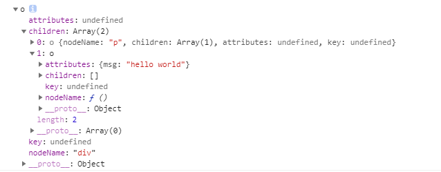

# 浅谈react
> react是什么？其官网给出了明确定义：`A JavaScript library for building user interfaces`，一个用于构建用户界面的JavaScript库。

## 1. Thinking in React  
通常情况下前端的界面可以用一个简单的公式来抽象：
```js
  view = fn(state)
```
举个例子，现在有这么一个需求：根据一组信息渲染一个列表
```js
let infos = [
  { name: 'zhangsan' },
  { name: 'lisi' },
  { name: 'wangwu' },
  ...
]

function render() {
  // 清空列表
  $ul.removeAll();
  // 重新渲染列表
  infos.forEach(i => $ul.append(generateLi(i)));
}
```
很完美，只要数据一变执行`render`方法就好了，坏处是每次都要重新渲染整个页面，而浏览器的渲染和js执行是同一个线程，数据量很大时可能会造成页面的卡顿。现在我们再回过头来看公式，`fn`是什么？事实上`fn`是实现数据到视图映射的方法，上面就是一种比较原始的实现。对于react，笔者认为其`fn`可以表示为：
```js
  function fn() {
    virtualDom();
    component();
  }
```

### 1.1 虚拟dom
上文中提到视图是数据的表现，当数据改变时可以清空所有的dom节点然后重新渲染视图，缺点是可能造成了很大的浪费，因为大部分的dom节点可能并没有变，比如渲染一个列表，可能只是插入了一条数据：
  

那么有没有方法是在渲染之前先进行比较，然后只改变更新的dom节点？虚拟dom正好可以做这件事，虚拟dom是真实dom节点的数据结构映射，只要给出了一定的规范，就可以利用虚拟dom表示真实的dom。举个例子，更新前的列表可以这么表示：
```html
// real dom
<ul>
  <li>zhang san</li>
  <li>wang wu</li>
<ul>
```
```js
// virtual dom 
{
  tag: 'ul',
  children: [
    {
      tag: 'li',
      text: 'zhang san'
    },
    {
      tag: 'li',
      text: 'wang wu'
    }
  ]
}
```
同样的更新后的列表依然可以使用虚拟dom表示，虚拟dom之间的diff是十分快的，只要把虚拟dom的差异映射到真实dom节点上即可完成视图的更新。

### 1.2 组件化
谈到组件化首先想到的是代码复用，但组件化不止如此。虚拟dom只是优化了数据到视图的映射方式，但是当数据改变时，应该选择什么样的范围进行diff其并没有给出。假设我们的页面结构如下：
 

想象一下，假如仅仅因为list插入了一条数据就对整个视图diff，即使js引擎很快但这样的效率无疑也是很低的，我们更希望的是将数据拆分，每次数据改变只对一个可控的范围进行diff，而其余的部分不受影响。组件化刚好解决了这样的问题，我们可以将页面拆分为如下：
```html
<div>
  <Sider />
  <div>
    <Header />
    <List />
    <Footer />
  </div>
</div>
```
通过划分组件，可以将视图隔离为相互独立的部分，List组件的状态改变时只要对List进行diff即可，而其余的组件不受影响。所以组件化让我们有了定义diff粒度的能力，提高了数据变化时视图的更新效率。

## 2. React渲染流程
> 注：本文没有考虑fiber架构 

### 2.1 组件渲染流程
一个React应用可以看做是一个相对较大的组件，所以标题React渲染流程更多是指一个组件的渲染流程。组件的渲染流程可简单的分为两步：
- 初始渲染
- 更新渲染

#### 2.1.1 初始渲染
初始渲染的流程相对简单，根据状态构建虚拟dom，根据虚拟dom渲染真实dom：
```js
state => virtual dom => view
```
虚拟dom的构建是在render方法中进行的，首先需要明确jsx语法只是`React.createElement`的语法糖
```jsx
// JSX
<div>
  <p>this is parent</p>  
  <ChildComponent msg={ msg } />    
</div>
```

```js
// Babel转译之后
React.createElement(
  "div",
  null,
  React.createElement(
    "p",
    null,
    "this is parent"
  ),
  React.createElement(ChildComponent, { msg: msg })
);
```
可以猜测，`React.createElement`就是构造虚拟dom的方法，事实上上例会返回一个类似如下的虚拟dom，然后根据虚拟dom深度优先构建真实dom树
  

#### 2.1.2 更新渲染
更新渲染时首先会对更新前后的虚拟dom进行diff，然后将差异patch到真实dom即可完成组件的更新。虚拟dom进行diff时会根据类型的不同采取不同的策略，笔者根据虚拟dom`nodeName`类型的不同将其划分为两种：
- html vnode
原生dom标签对应的虚拟dom
- component vnode
组件标签对应的虚拟dom  

参考上面例子，`html vnode`对应：


`component vnode`对应：


`html vnode`的更新相对简单，可以简单的理解为对比虚拟dom的nodeName，相同表明真实dom可以复用，只更新属性和子节点即可，不同则创建新的dom并删除掉旧的dom节点。  

`component vnode`的diff相对复杂，也可以近似理解为先对比虚拟dom的nodeName是否相同，如果相同则走组件更新对应的生命周期，反之旧虚拟dom对应的组件会被`unmount`，同时实例化新虚拟dom对应的组件。这里需要注意`component vnode`的nodeName指向的是组件的构造函数，我们在写jsx时要确保组件的标签名指向的确实是同一个组件，否则可能会出现组件的状态丢失，除非你有意为之。

### 2.2 组件更新时机
什么行为会导致触发组件更新？
- 组件执行了setState
- 组件的父组件执行了rerender 

我们知道，只要执行了`setState`组件就会执行更新过程，但是父组件rerender一定会引起子组件rerender吗？结论是肯定的，react中只要某一组件的状态发生改变，就会以该组件为根重新渲染整个组件树，即使子组件的`props`没有发生改变。这似乎很傻，因此react暴露了`shouldComponentUpdate`方法给我们手动控制组件是否渲染：
```js
shouldComponentUpdate(nextProps, nextState) {
  if (this.props.color !== nextProps.color) {
    return true;
  }
  if (this.state.count !== nextState.count) {
    return true;
  }
  return false;
}
```
当`shouldComponentUpdate`返回`false`时就会跳过组件更新流程。

## 3. PureComponent和Immutable
在使用`redux`时我们知道`reducer`必须是`pure function`，纯函数有两个显著的特点：

- 相同的输入必然会得到相同的输出
- 函数是无副作用的，不依赖于外部状态也不会改变外部状态 

抽象点来看组件其实也是一个函数，它接收两个参数`props`和`state`，返回一个`view`。借鉴纯函数的概念，`PureComponent`显然是指当`props`和`state`不变时渲染相同视图的组件，其原理类似是一个高阶组件，内部实现了`shouldComponentUpdate`方法，当`props`和`state`不变时会跳过组件更新过程，省去了虚拟dom生成和diff的过程。这样看来似乎使用`PureComponent`可以极大的提供react的性能，但是这里还有一个重要的前提：`PureComponent`执行的是浅比较，稍不注意可能会出现问题，看下面的代码：
```jsx
class List extends PureComponent {
  render() {
    const list = this.props.list;
    return (
      <ul>
        {
          list.map(i => {
            return <li>{ i.now }</li>
          })
        }
      </ul>
    )
  }
}

class App extends Component {
  state = {
    list: [{ now: new Date().getTime() }]
  }

  add = () => {
    const list = this.state.list;
    list.push({ now: new Date().getTime() });
    this.setState({ list })
  }

  render() {
    const list = this.state.list;
    return (
      <div>
        <List list={list} />
        <button onClick={this.add}>time log</button>
      </div>
    )
  }
}
```
上例中List是一个`PureComponent`，其props中list是一个复杂数据结构（数组），而`PureComponent`只会对props进行浅比较，本例中list的指向不会发生改变，因此无论怎么点击button组件都不会更新。

那么应该什么时候使用`PureComponent`呢？
- 显然当组件的`props`和`state`为简单类型时必然可以使用
- 当组件的`props`和`state`为复杂类型时保证数据的Immutable 

理论上我们可以改变state的唯一途径就是执行`setState`方法，只要保证`setState`是immutble的即可，结合上例：
```js
class App extends Component {
  ...

  add = () => {
    const list = this.state.list;
    const newList = [...list, { now: new Date().getTime() }];
    this.setState({ list: newList });
  }

  ...
}
```
事实上`setState`还可以传入一个函数，参数是当前的state，返回值为新的state：
```js
setState(updater[, callback])
```
类似于redux中reducer，上例可改写为：
```js
const genListUpdater = payload => state => {
  const list = state.list;
  return {
    list: [...list, payload]
  };
}

class App extends Component {
  ...

  add = () => {
    this.setState(genListUpdater({ now: new Date().getTime() }));
  }

  ...
}
```
但是还有一个问题，当数据的嵌套层级较深时保持数据的immutable很费劲，根据具体情况可以考虑使用[ImmutableJs](https://facebook.github.io/immutable-js/)处理。


---
全文完